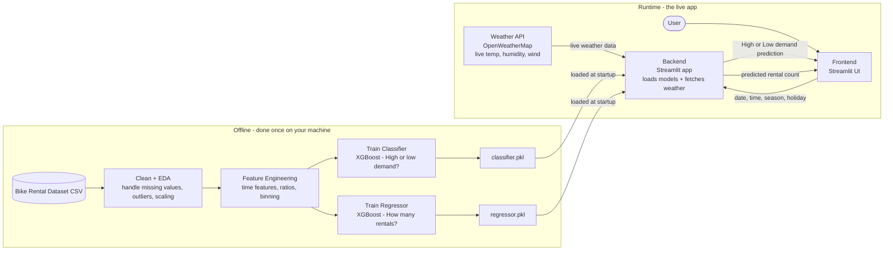

# Bike Rental ML App — Architecture

## Mermaid Source

## Written Explanation

The models are trained **offline, once**, on the local machine using the bike rental CSV dataset.
After cleaning, EDA, and feature engineering, two XGBoost models are fitted — a classifier
(high vs. low demand) and a regressor (predicted rental count) — and saved as `classifier.pkl`
and `regressor.pkl`.

At **runtime**, the Streamlit app loads both model files once on startup (no retraining ever
happens live). When the user submits inputs (date, time, season, holiday flag), the backend
simultaneously fetches live weather data from the OpenWeatherMap API (temperature, humidity,
wind speed) and combines it with the user inputs to form the full feature vector.
The backend then calls `model.predict()` on both models and returns the classification result
and the regression estimate to the frontend — the weather API is the only live external call.
